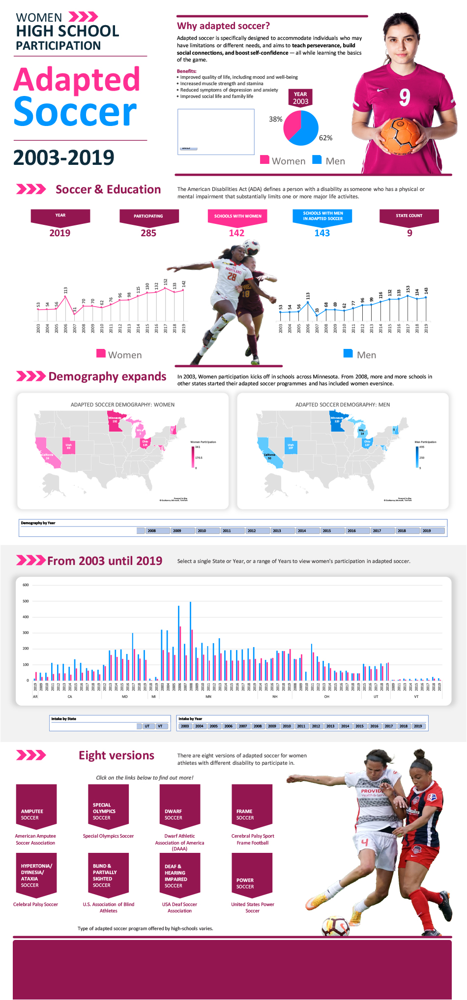

# Capstone_Women-Adapted-Soccer
This dataset is presented as a "Infographic Dashboard" which focuses on high-school women participation for adapted soccer in the United States from 2003 to 2019. It includes data on the number of schools participating, the number of students participating, the gender split of participants, and the number of participating states.\

