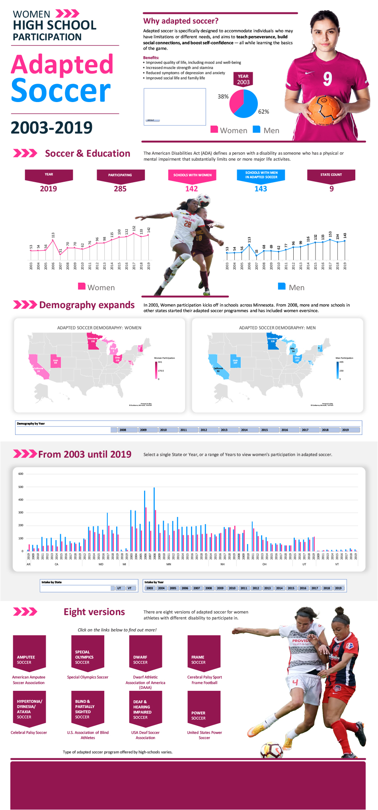

##### Capstone - Dashboard Design
---
---
# Women High School Participation: **ADAPTED SOCCER**, 2003-2019

---
---
#### Dashboard Screenshot

#### Dataset source
Filename: Women's Soccer Participation in High Schools \
File type: CSV \
Column: 8 \
Rows: 55,136 \
Credit: Eva Murray \
File link: https://www.kaggle.com/datasets/thedevastator/women-s-soccer-participation-in-high-schools-fro

#### Description of Dataset
This dataset is presented as a "Infographic Dashboard" which focuses on high-school women participation for adapted soccer in the United States from 2003 to 2019. It includes data on the number of schools participating, the number of students participating, the gender split of participants, and the number of participating states.

For the purpose of this capstone, the dataset was cleaned and modified to analyse interest of participation in the specific area of adapted sport, especially for women with impairment or physical disability. 

#### Dataset Learning Journey
Interest in soccer grew since the USA women soccer team won the FIFA Women's World Cup in the USA 1999 tournament. On top of that, the USA women soccer team has won the CONCACAF W Championship nine times since 1991. 

From the dataset, it is evident that the number of women participating in adapter soccer increased in 2006, 2014 and 2018 respectively. And those were the years that the USA women soccer team were throned as CONCACAF champions.

Why adapted soccer?
Adapted soccer is specifically designed to accommodate individuals who may have limitations or different needs, and aims to teach perseverance, build social connections, and boost self-confidence — all while learning the basics of the game.

It is an accessible sport for a wide spectrum of impairment and disability, and it has the following benefits:
- Improves quality of life, including mood and well-being
- Increased muscle strength and stamina
- Reduced symptoms of depression and anxiety
- Improved social life and family life

#### Dataset Modications
- Removed 'INDEX' column
- Convert 'YEAR' format '2018/2019' to '2019' using RIGHT function
- Find and Replace Empty Cells in 'Participation' column with numeric Zero which represents No Participation.
- Filter for 'Adapted Soccer' in 'Sports' column
- Filter for schools that has "True" participation in adapted soccer
- Added "Country" column and filled cells with 'USA'. This will be useful when creating MAP. 

---

#### Find Me
- [LinkedIn](www.linkedin.com/in/muhammd-khairi-boyani-10694061)
- [Instagram](https://www.instagram.com/mikistudio21/)

---

#### Useful links for Adapted Soccer, USA:
- [American Amputee Soccer Association](http://www.ampsoccer.org/)
- [Celebral Palsy Sport Frame Football](http://www.cpsport.org/sports/football/frame-football/)
- [Celebral Palsy Soccer](https://www.cpsoccer.us/)
- [Dwarf Athletic Association of America (DAAA)](http://www.daaa.org/)
- [Special Olympics Soccer](http://resources.specialolympics.org/Taxonomy/Sports_Essentials/_Sports_Info/Football.aspx)
- [United States Power Soccer](https://www.powersoccerusa.org/)
- [U.S. Association of Blind Athletes](https://www.usaba.org/)
- [USA Deaf Soccer Association](https://usdeafsoccer.com/)

#### Image Credits:
- Jeffrey F Lin by Unsplash
- Sporlab by Unsplash

---
